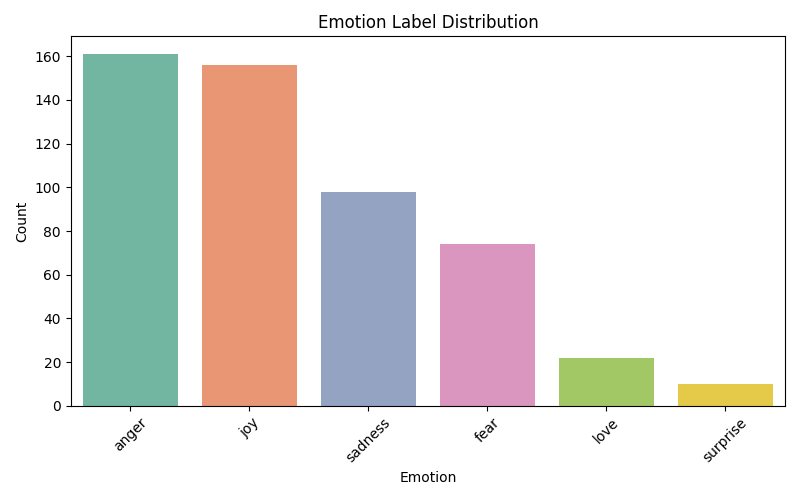
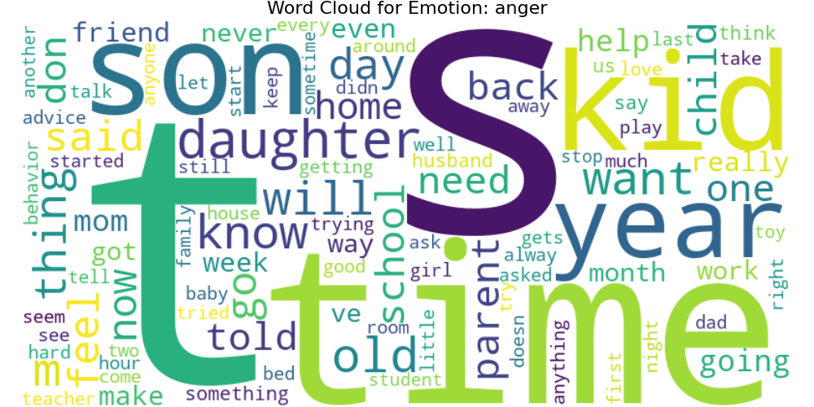
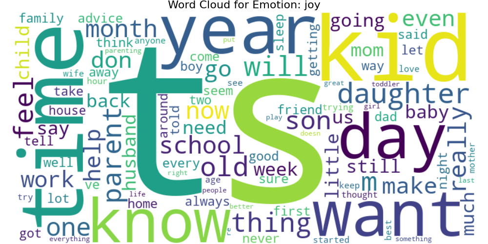

# Parenting in the Digital Age: Emotion Detection from Online Posts Using Transformer Models

## Project Overview

This project explores how parents emotionally respond to their children’s use of AI technologies—such as chatbots, conversational agents, and generative tools—by analyzing real-world discussions on Reddit. Using transformer-based emotion classification models, dominant emotional reactions and underlying linguistic patterns are identified. The findings contribute to our understanding of digital parenting in the AI era and can inform the design of emotionally responsive tools and interventions to support families.
## Research Questions

1. What emotions do parents express when discussing their children’s interactions with AI tools (e.g., ChatGPT, Replika)?

2. What types of language and themes characterize emotionally intense reactions—such as joy or anger—toward youth-AI interaction?

## Method

- **Data Collection**: Compiled a dataset of posts from parenting-related community on reddit.
- **Preprocessing**: Cleaned and prepared text data, ensuring compatibility with transformer models.
- **Emotion Classification**: Applied the bhadresh-savani/distilbert-base-uncased-emotion transformer model via HuggingFace’s pipeline to assign one of six emotion labels (joy, anger, sadness, fear, love, surprise) to each Reddit post, using top-1 prediction.
- **Visualization**: 
  - Bar chart to depict emotion distribution.
  - Word clouds to highlight prominent terms associated with specific emotions.

## Results

### Emotion Distribution

The analysis revealed that anger and joy were the most frequently predicted emotions in posts where parents discussed their children’s interactions with AI tools. This pattern may reflect both frustration and concern, as well as moments of delight or curiosity, highlighting the emotional complexity parents experience when navigating technology use in parenting.

### Word Clouds

Distinct linguistic patterns emerged for different emotions:

#### Anger

Keywords: told, stop, behavior, hard, never, wrong, teacher
Themes: Conflict, frustration with discipline, and emotional overload
Linguistic Tone: Reactive, boundary-focused, emotionally charged
#### Joy

Keywords: love, baby, family, together, proud, fun, first, happy
Themes: Celebrating milestones, affection, quality time, and bonding
Linguistic Tone: Positive, warm, future-oriented

| Feature         | Joy                             | Anger                              |
| --------------- | ------------------------------- | ---------------------------------- |
| Emotional Focus | Connection, celebration, growth | Conflict, stress, discipline       |
| Common Words    | time, kid, parent, day, know    | time, kid, parent, day, know       |
| Unique Words    | love, happy, play, first, proud | told, stop, behavior, never, wrong |
| Language Tone   | Warm, grateful, nurturing       | Frustrated, urgent, overloaded     |

Both emotions center on parent-child interactions, but diverge sharply in tone and focus. Joyful posts tend to emphasize shared experiences and milestones, while angry posts are often centered around misbehavior, boundary-setting, and lack of support.

## Discussion

This study explored the emotional responses of parents in online communities discussing their children's interactions with artificial intelligence (AI) technologies such as chatbots, AI companions, and generative tools like ChatGPT. Using a transformer-based emotion classification model, we identified anger and joy as the most frequently expressed emotions in these posts, followed by sadness and fear. This dual presence of concern and enthusiasm underscores the ambivalence parents feel toward emerging AI tools: while some embrace them as educational or social aids, others express worry over their ethical implications, psychological impact, or influence on behavior.

The word clouds for anger and joy further illuminate these emotional undercurrents. Posts labeled with anger often reference frustration, privacy concerns, or discipline issues—suggesting discomfort with the loss of control or misalignment in values between human and machine guidance. In contrast, joyful posts highlight novelty, bonding moments, or child-led curiosity, reflecting how some parents view AI as a creative extension of learning or play.

These findings offer insights for the design of emotionally attuned AI systems. As AI becomes more embedded in children's lives, tools that support parental understanding, emotional validation, and constructive guidance will become increasingly valuable. Designing with parental affect in mind may help bridge trust gaps and foster healthier digital ecosystems for families.

Future directions include validating these findings with annotated datasets, refining emotion detection for multi-label or nuanced emotions, and exploring how parental attitudes toward AI evolve over time. Longitudinal or cross-cultural studies may further reveal how digital parenting is being reshaped in the age of synthetic relationships and algorithmic companions.

Ethical Note on Data Privacy:

While Reddit posts are publicly accessible, this project adheres to ethical guidelines for using user-generated content. Full post texts and usernames have been excluded, and only anonymized summaries, aggregated statistics, and visualizations are shared. No content that could identify individual users has been included, ensuring the analysis remains respectful, privacy-conscious, and responsible.
